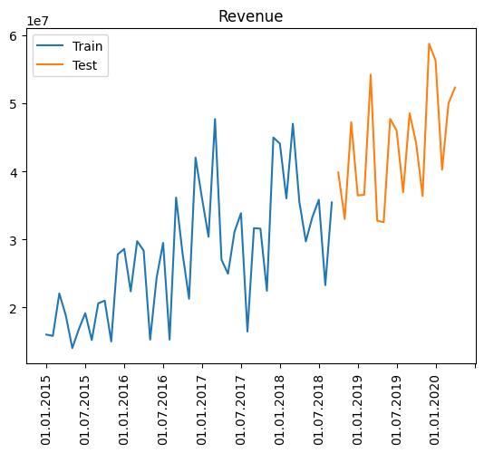

***

# Recurrent Neural Network with PyTorch

**Implemention of recurrent neural network to forecast company revenue using PyTorch**

*Posted on: January 2024*

***

Below is an implementation of recurrent neural network (RNN) with PyTorch to forecast the revenue of certain a company from 2015 to 2020.

The data is taken from [here](https://www.kaggle.com/datasets/podsyp/time-series-starter-dataset).


```python
import pandas as pd
import numpy as np
import matplotlib.pyplot as plt
import matplotlib.ticker as ticker
import torch

from glob import glob
import os
```


```python
data_path = '/content/drive/MyDrive/Colab Notebooks/data/Time Series Starter Dataset/Month_Value_1.csv'

df = pd.read_csv(data_path)
```


```python
df
```


  <div id="df-04483128-6de1-4099-822b-6876a0be1343" class="colab-df-container">
    <div>
<style scoped>
    .dataframe tbody tr th:only-of-type {
        vertical-align: middle;
    }

    .dataframe tbody tr th {
        vertical-align: top;
    }

    .dataframe thead th {
        text-align: right;
    }
</style>
<table border="1" class="dataframe">
  <thead>
    <tr style="text-align: right;">
      <th></th>
      <th>Period</th>
      <th>Revenue</th>
      <th>Sales_quantity</th>
      <th>Average_cost</th>
      <th>The_average_annual_payroll_of_the_region</th>
    </tr>
  </thead>
  <tbody>
    <tr>
      <th>0</th>
      <td>01.01.2015</td>
      <td>1.601007e+07</td>
      <td>12729.0</td>
      <td>1257.763541</td>
      <td>30024676.0</td>
    </tr>
    <tr>
      <th>1</th>
      <td>01.02.2015</td>
      <td>1.580759e+07</td>
      <td>11636.0</td>
      <td>1358.507000</td>
      <td>30024676.0</td>
    </tr>
    <tr>
      <th>2</th>
      <td>01.03.2015</td>
      <td>2.204715e+07</td>
      <td>15922.0</td>
      <td>1384.697024</td>
      <td>30024676.0</td>
    </tr>
    <tr>
      <th>3</th>
      <td>01.04.2015</td>
      <td>1.881458e+07</td>
      <td>15227.0</td>
      <td>1235.606705</td>
      <td>30024676.0</td>
    </tr>
    <tr>
      <th>4</th>
      <td>01.05.2015</td>
      <td>1.402148e+07</td>
      <td>8620.0</td>
      <td>1626.621765</td>
      <td>30024676.0</td>
    </tr>
    <tr>
      <th>...</th>
      <td>...</td>
      <td>...</td>
      <td>...</td>
      <td>...</td>
      <td>...</td>
    </tr>
    <tr>
      <th>91</th>
      <td>01.08.2022</td>
      <td>NaN</td>
      <td>NaN</td>
      <td>NaN</td>
      <td>NaN</td>
    </tr>
    <tr>
      <th>92</th>
      <td>01.09.2022</td>
      <td>NaN</td>
      <td>NaN</td>
      <td>NaN</td>
      <td>NaN</td>
    </tr>
    <tr>
      <th>93</th>
      <td>01.10.2022</td>
      <td>NaN</td>
      <td>NaN</td>
      <td>NaN</td>
      <td>NaN</td>
    </tr>
    <tr>
      <th>94</th>
      <td>01.11.2022</td>
      <td>NaN</td>
      <td>NaN</td>
      <td>NaN</td>
      <td>NaN</td>
    </tr>
    <tr>
      <th>95</th>
      <td>01.12.2022</td>
      <td>NaN</td>
      <td>NaN</td>
      <td>NaN</td>
      <td>NaN</td>
    </tr>
  </tbody>
</table>
<p>96 rows × 5 columns</p>
</div>
    <div class="colab-df-buttons">

  <div class="colab-df-container">
    <button class="colab-df-convert" onclick="convertToInteractive('df-04483128-6de1-4099-822b-6876a0be1343')"
            title="Convert this dataframe to an interactive table."
            style="display:none;">

  <svg xmlns="http://www.w3.org/2000/svg" height="24px" viewBox="0 -960 960 960">
    <path d="M120-120v-720h720v720H120Zm60-500h600v-160H180v160Zm220 220h160v-160H400v160Zm0 220h160v-160H400v160ZM180-400h160v-160H180v160Zm440 0h160v-160H620v160ZM180-180h160v-160H180v160Zm440 0h160v-160H620v160Z"/>
  </svg>
    </button>

  <style>
    .colab-df-container {
      display:flex;
      gap: 12px;
    }

    .colab-df-convert {
      background-color: #E8F0FE;
      border: none;
      border-radius: 50%;
      cursor: pointer;
      display: none;
      fill: #1967D2;
      height: 32px;
      padding: 0 0 0 0;
      width: 32px;
    }

    .colab-df-convert:hover {
      background-color: #E2EBFA;
      box-shadow: 0px 1px 2px rgba(60, 64, 67, 0.3), 0px 1px 3px 1px rgba(60, 64, 67, 0.15);
      fill: #174EA6;
    }

    .colab-df-buttons div {
      margin-bottom: 4px;
    }

    [theme=dark] .colab-df-convert {
      background-color: #3B4455;
      fill: #D2E3FC;
    }

    [theme=dark] .colab-df-convert:hover {
      background-color: #434B5C;
      box-shadow: 0px 1px 3px 1px rgba(0, 0, 0, 0.15);
      filter: drop-shadow(0px 1px 2px rgba(0, 0, 0, 0.3));
      fill: #FFFFFF;
    }
  </style>

    <script>
      const buttonEl =
        document.querySelector('#df-04483128-6de1-4099-822b-6876a0be1343 button.colab-df-convert');
      buttonEl.style.display =
        google.colab.kernel.accessAllowed ? 'block' : 'none';

      async function convertToInteractive(key) {
        const element = document.querySelector('#df-04483128-6de1-4099-822b-6876a0be1343');
        const dataTable =
          await google.colab.kernel.invokeFunction('convertToInteractive',
                                                    [key], {});
        if (!dataTable) return;

        const docLinkHtml = 'Like what you see? Visit the ' +
          '<a target="_blank" href=https://colab.research.google.com/notebooks/data_table.ipynb>data table notebook</a>'
          + ' to learn more about interactive tables.';
        element.innerHTML = '';
        dataTable['output_type'] = 'display_data';
        await google.colab.output.renderOutput(dataTable, element);
        const docLink = document.createElement('div');
        docLink.innerHTML = docLinkHtml;
        element.appendChild(docLink);
      }
    </script>
  </div>


<div id="df-0800ba34-b142-4742-9202-6d524897c756">
  <button class="colab-df-quickchart" onclick="quickchart('df-0800ba34-b142-4742-9202-6d524897c756')"
            title="Suggest charts"
            style="display:none;">

<svg xmlns="http://www.w3.org/2000/svg" height="24px"viewBox="0 0 24 24"
     width="24px">
    <g>
        <path d="M19 3H5c-1.1 0-2 .9-2 2v14c0 1.1.9 2 2 2h14c1.1 0 2-.9 2-2V5c0-1.1-.9-2-2-2zM9 17H7v-7h2v7zm4 0h-2V7h2v10zm4 0h-2v-4h2v4z"/>
    </g>
</svg>
  </button>

<style>
  .colab-df-quickchart {
      --bg-color: #E8F0FE;
      --fill-color: #1967D2;
      --hover-bg-color: #E2EBFA;
      --hover-fill-color: #174EA6;
      --disabled-fill-color: #AAA;
      --disabled-bg-color: #DDD;
  }

  [theme=dark] .colab-df-quickchart {
      --bg-color: #3B4455;
      --fill-color: #D2E3FC;
      --hover-bg-color: #434B5C;
      --hover-fill-color: #FFFFFF;
      --disabled-bg-color: #3B4455;
      --disabled-fill-color: #666;
  }

  .colab-df-quickchart {
    background-color: var(--bg-color);
    border: none;
    border-radius: 50%;
    cursor: pointer;
    display: none;
    fill: var(--fill-color);
    height: 32px;
    padding: 0;
    width: 32px;
  }

  .colab-df-quickchart:hover {
    background-color: var(--hover-bg-color);
    box-shadow: 0 1px 2px rgba(60, 64, 67, 0.3), 0 1px 3px 1px rgba(60, 64, 67, 0.15);
    fill: var(--button-hover-fill-color);
  }

  .colab-df-quickchart-complete:disabled,
  .colab-df-quickchart-complete:disabled:hover {
    background-color: var(--disabled-bg-color);
    fill: var(--disabled-fill-color);
    box-shadow: none;
  }

  .colab-df-spinner {
    border: 2px solid var(--fill-color);
    border-color: transparent;
    border-bottom-color: var(--fill-color);
    animation:
      spin 1s steps(1) infinite;
  }

  @keyframes spin {
    0% {
      border-color: transparent;
      border-bottom-color: var(--fill-color);
      border-left-color: var(--fill-color);
    }
    20% {
      border-color: transparent;
      border-left-color: var(--fill-color);
      border-top-color: var(--fill-color);
    }
    30% {
      border-color: transparent;
      border-left-color: var(--fill-color);
      border-top-color: var(--fill-color);
      border-right-color: var(--fill-color);
    }
    40% {
      border-color: transparent;
      border-right-color: var(--fill-color);
      border-top-color: var(--fill-color);
    }
    60% {
      border-color: transparent;
      border-right-color: var(--fill-color);
    }
    80% {
      border-color: transparent;
      border-right-color: var(--fill-color);
      border-bottom-color: var(--fill-color);
    }
    90% {
      border-color: transparent;
      border-bottom-color: var(--fill-color);
    }
  }
</style>

  <script>
    async function quickchart(key) {
      const quickchartButtonEl =
        document.querySelector('#' + key + ' button');
      quickchartButtonEl.disabled = true;  // To prevent multiple clicks.
      quickchartButtonEl.classList.add('colab-df-spinner');
      try {
        const charts = await google.colab.kernel.invokeFunction(
            'suggestCharts', [key], {});
      } catch (error) {
        console.error('Error during call to suggestCharts:', error);
      }
      quickchartButtonEl.classList.remove('colab-df-spinner');
      quickchartButtonEl.classList.add('colab-df-quickchart-complete');
    }
    (() => {
      let quickchartButtonEl =
        document.querySelector('#df-0800ba34-b142-4742-9202-6d524897c756 button');
      quickchartButtonEl.style.display =
        google.colab.kernel.accessAllowed ? 'block' : 'none';
    })();
  </script>
</div>
    </div>
  </div>


Remove empty data


```python
df = df.dropna()
df
```


  <div id="df-7dedd764-e6f5-4cc0-a3bd-1bc804de3dc3" class="colab-df-container">
    <div>
<style scoped>
    .dataframe tbody tr th:only-of-type {
        vertical-align: middle;
    }

    .dataframe tbody tr th {
        vertical-align: top;
    }

    .dataframe thead th {
        text-align: right;
    }
</style>
<table border="1" class="dataframe">
  <thead>
    <tr style="text-align: right;">
      <th></th>
      <th>Period</th>
      <th>Revenue</th>
      <th>Sales_quantity</th>
      <th>Average_cost</th>
      <th>The_average_annual_payroll_of_the_region</th>
    </tr>
  </thead>
  <tbody>
    <tr>
      <th>0</th>
      <td>01.01.2015</td>
      <td>1.601007e+07</td>
      <td>12729.0</td>
      <td>1257.763541</td>
      <td>30024676.0</td>
    </tr>
    <tr>
      <th>1</th>
      <td>01.02.2015</td>
      <td>1.580759e+07</td>
      <td>11636.0</td>
      <td>1358.507000</td>
      <td>30024676.0</td>
    </tr>
    <tr>
      <th>2</th>
      <td>01.03.2015</td>
      <td>2.204715e+07</td>
      <td>15922.0</td>
      <td>1384.697024</td>
      <td>30024676.0</td>
    </tr>
    <tr>
      <th>3</th>
      <td>01.04.2015</td>
      <td>1.881458e+07</td>
      <td>15227.0</td>
      <td>1235.606705</td>
      <td>30024676.0</td>
    </tr>
    <tr>
      <th>4</th>
      <td>01.05.2015</td>
      <td>1.402148e+07</td>
      <td>8620.0</td>
      <td>1626.621765</td>
      <td>30024676.0</td>
    </tr>
    <tr>
      <th>...</th>
      <td>...</td>
      <td>...</td>
      <td>...</td>
      <td>...</td>
      <td>...</td>
    </tr>
    <tr>
      <th>59</th>
      <td>01.12.2019</td>
      <td>5.875647e+07</td>
      <td>38069.0</td>
      <td>1543.420464</td>
      <td>29878525.0</td>
    </tr>
    <tr>
      <th>60</th>
      <td>01.01.2020</td>
      <td>5.628830e+07</td>
      <td>27184.0</td>
      <td>2070.640850</td>
      <td>29044998.0</td>
    </tr>
    <tr>
      <th>61</th>
      <td>01.02.2020</td>
      <td>4.022524e+07</td>
      <td>23509.0</td>
      <td>1711.057181</td>
      <td>29044998.0</td>
    </tr>
    <tr>
      <th>62</th>
      <td>01.03.2020</td>
      <td>5.002217e+07</td>
      <td>32569.0</td>
      <td>1535.882748</td>
      <td>29044998.0</td>
    </tr>
    <tr>
      <th>63</th>
      <td>01.04.2020</td>
      <td>5.232069e+07</td>
      <td>26615.0</td>
      <td>1965.834790</td>
      <td>29044998.0</td>
    </tr>
  </tbody>
</table>
<p>64 rows × 5 columns</p>
</div>
    <div class="colab-df-buttons">

  <div class="colab-df-container">
    <button class="colab-df-convert" onclick="convertToInteractive('df-7dedd764-e6f5-4cc0-a3bd-1bc804de3dc3')"
            title="Convert this dataframe to an interactive table."
            style="display:none;">

  <svg xmlns="http://www.w3.org/2000/svg" height="24px" viewBox="0 -960 960 960">
    <path d="M120-120v-720h720v720H120Zm60-500h600v-160H180v160Zm220 220h160v-160H400v160Zm0 220h160v-160H400v160ZM180-400h160v-160H180v160Zm440 0h160v-160H620v160ZM180-180h160v-160H180v160Zm440 0h160v-160H620v160Z"/>
  </svg>
    </button>

  <style>
    .colab-df-container {
      display:flex;
      gap: 12px;
    }

    .colab-df-convert {
      background-color: #E8F0FE;
      border: none;
      border-radius: 50%;
      cursor: pointer;
      display: none;
      fill: #1967D2;
      height: 32px;
      padding: 0 0 0 0;
      width: 32px;
    }

    .colab-df-convert:hover {
      background-color: #E2EBFA;
      box-shadow: 0px 1px 2px rgba(60, 64, 67, 0.3), 0px 1px 3px 1px rgba(60, 64, 67, 0.15);
      fill: #174EA6;
    }

    .colab-df-buttons div {
      margin-bottom: 4px;
    }

    [theme=dark] .colab-df-convert {
      background-color: #3B4455;
      fill: #D2E3FC;
    }

    [theme=dark] .colab-df-convert:hover {
      background-color: #434B5C;
      box-shadow: 0px 1px 3px 1px rgba(0, 0, 0, 0.15);
      filter: drop-shadow(0px 1px 2px rgba(0, 0, 0, 0.3));
      fill: #FFFFFF;
    }
  </style>

    <script>
      const buttonEl =
        document.querySelector('#df-7dedd764-e6f5-4cc0-a3bd-1bc804de3dc3 button.colab-df-convert');
      buttonEl.style.display =
        google.colab.kernel.accessAllowed ? 'block' : 'none';

      async function convertToInteractive(key) {
        const element = document.querySelector('#df-7dedd764-e6f5-4cc0-a3bd-1bc804de3dc3');
        const dataTable =
          await google.colab.kernel.invokeFunction('convertToInteractive',
                                                    [key], {});
        if (!dataTable) return;

        const docLinkHtml = 'Like what you see? Visit the ' +
          '<a target="_blank" href=https://colab.research.google.com/notebooks/data_table.ipynb>data table notebook</a>'
          + ' to learn more about interactive tables.';
        element.innerHTML = '';
        dataTable['output_type'] = 'display_data';
        await google.colab.output.renderOutput(dataTable, element);
        const docLink = document.createElement('div');
        docLink.innerHTML = docLinkHtml;
        element.appendChild(docLink);
      }
    </script>
  </div>


<div id="df-fbe36757-16bd-455f-bcf1-4a307722910a">
  <button class="colab-df-quickchart" onclick="quickchart('df-fbe36757-16bd-455f-bcf1-4a307722910a')"
            title="Suggest charts"
            style="display:none;">

<svg xmlns="http://www.w3.org/2000/svg" height="24px"viewBox="0 0 24 24"
     width="24px">
    <g>
        <path d="M19 3H5c-1.1 0-2 .9-2 2v14c0 1.1.9 2 2 2h14c1.1 0 2-.9 2-2V5c0-1.1-.9-2-2-2zM9 17H7v-7h2v7zm4 0h-2V7h2v10zm4 0h-2v-4h2v4z"/>
    </g>
</svg>
  </button>

<style>
  .colab-df-quickchart {
      --bg-color: #E8F0FE;
      --fill-color: #1967D2;
      --hover-bg-color: #E2EBFA;
      --hover-fill-color: #174EA6;
      --disabled-fill-color: #AAA;
      --disabled-bg-color: #DDD;
  }

  [theme=dark] .colab-df-quickchart {
      --bg-color: #3B4455;
      --fill-color: #D2E3FC;
      --hover-bg-color: #434B5C;
      --hover-fill-color: #FFFFFF;
      --disabled-bg-color: #3B4455;
      --disabled-fill-color: #666;
  }

  .colab-df-quickchart {
    background-color: var(--bg-color);
    border: none;
    border-radius: 50%;
    cursor: pointer;
    display: none;
    fill: var(--fill-color);
    height: 32px;
    padding: 0;
    width: 32px;
  }

  .colab-df-quickchart:hover {
    background-color: var(--hover-bg-color);
    box-shadow: 0 1px 2px rgba(60, 64, 67, 0.3), 0 1px 3px 1px rgba(60, 64, 67, 0.15);
    fill: var(--button-hover-fill-color);
  }

  .colab-df-quickchart-complete:disabled,
  .colab-df-quickchart-complete:disabled:hover {
    background-color: var(--disabled-bg-color);
    fill: var(--disabled-fill-color);
    box-shadow: none;
  }

  .colab-df-spinner {
    border: 2px solid var(--fill-color);
    border-color: transparent;
    border-bottom-color: var(--fill-color);
    animation:
      spin 1s steps(1) infinite;
  }

  @keyframes spin {
    0% {
      border-color: transparent;
      border-bottom-color: var(--fill-color);
      border-left-color: var(--fill-color);
    }
    20% {
      border-color: transparent;
      border-left-color: var(--fill-color);
      border-top-color: var(--fill-color);
    }
    30% {
      border-color: transparent;
      border-left-color: var(--fill-color);
      border-top-color: var(--fill-color);
      border-right-color: var(--fill-color);
    }
    40% {
      border-color: transparent;
      border-right-color: var(--fill-color);
      border-top-color: var(--fill-color);
    }
    60% {
      border-color: transparent;
      border-right-color: var(--fill-color);
    }
    80% {
      border-color: transparent;
      border-right-color: var(--fill-color);
      border-bottom-color: var(--fill-color);
    }
    90% {
      border-color: transparent;
      border-bottom-color: var(--fill-color);
    }
  }
</style>

  <script>
    async function quickchart(key) {
      const quickchartButtonEl =
        document.querySelector('#' + key + ' button');
      quickchartButtonEl.disabled = true;  // To prevent multiple clicks.
      quickchartButtonEl.classList.add('colab-df-spinner');
      try {
        const charts = await google.colab.kernel.invokeFunction(
            'suggestCharts', [key], {});
      } catch (error) {
        console.error('Error during call to suggestCharts:', error);
      }
      quickchartButtonEl.classList.remove('colab-df-spinner');
      quickchartButtonEl.classList.add('colab-df-quickchart-complete');
    }
    (() => {
      let quickchartButtonEl =
        document.querySelector('#df-fbe36757-16bd-455f-bcf1-4a307722910a button');
      quickchartButtonEl.style.display =
        google.colab.kernel.accessAllowed ? 'block' : 'none';
    })();
  </script>
</div>
    </div>
  </div>


Plot the data


```python
fig, ax = plt.subplots()
ax.plot(df['Period'], df['Revenue'])
plt.xticks(rotation=90)
ax.xaxis.set_major_locator(ticker.MultipleLocator(base=6))
plt.title("Revenue")
```


    Text(0.5, 1.0, 'Revenue')


    

    


```python
data = df['Revenue']
date = df['Period']
```

In this case, the data is divided into two categories: train and test. The composition of the train data is 70% of cleaned data while the other 30% is the test data.


```python
train_len = int(round(0.7*len(data), 0))

train = data[:train_len]
test = data[train_len:]
train_index = date[:train_len]
test_index = date[train_len:]
```


```python
fig, ax = plt.subplots()
ax.plot(train_index, train.values, label="Train")
ax.plot(test_index, test.values, label="Test")
plt.xticks(rotation=90)
plt.title("Revenue")
ax.xaxis.set_major_locator(ticker.MultipleLocator(base=6))
plt.legend()
```


    <matplotlib.legend.Legend at 0x7cde13361600>


    

    


Scaling is used in this case to make the train process quick. Otherwise it would have taken so much time to train the model.


```python
from sklearn.preprocessing import MinMaxScaler
scaler = MinMaxScaler(feature_range=(0,1))
# scaling dataset
train = scaler.fit_transform(train.values.reshape(-1, 1))
test = scaler.fit_transform(test.values.reshape(-1, 1))
```

In this model, the model will try to predict the next revenue for the company based on the previous four revenues. To do that, sequence the data in 4 months length.


```python
# Sequencing Train
sequence_length = 4
X_train, y_train = [], []

for i in range(len(train)-sequence_length):
  X_train.append(train[i:i+sequence_length])
  y_train.append(train[i+1:i+sequence_length+1])
X_train, y_train = np.array(X_train), np.array(y_train)

X_train = torch.tensor(X_train, dtype=torch.float32)
y_train = torch.tensor(y_train, dtype=torch.float32)
X_train.shape, y_train.shape
```


    (torch.Size([41, 4, 1]), torch.Size([41, 4, 1]))


```python
# Sequencing Test
sequence_length = 4
X_test, y_test = [], []

for i in range(len(test)-sequence_length):
  X_test.append(test[i:i+sequence_length])
  y_test.append(test[i+1:i+sequence_length+1])
X_test, y_test = np.array(X_test), np.array(y_test)

X_test = torch.tensor(X_test, dtype=torch.float32)
y_test = torch.tensor(y_test, dtype=torch.float32)
X_test.shape, y_test.shape
```


    (torch.Size([15, 4, 1]), torch.Size([15, 4, 1]))


The model use recurrent neural network (RNN) to predict the next revenue. More on RNN can be read here:

- https://stanford.edu/~shervine/teaching/cs-230/cheatsheet-recurrent-neural-networks

- https://machinelearningmastery.com/an-introduction-to-recurrent-neural-networks-and-the-math-that-powers-them/

- https://towardsdatascience.com/all-you-need-to-know-about-rnns-e514f0b00c7c


```python
class RNNmodel(torch.nn.Module):
  def __init__(self, input_size, hidden_size, num_layers):
    super(RNNmodel, self).__init__()
    self.rnn = torch.nn.RNN(input_size, hidden_size, num_layers, batch_first=True, nonlinearity='relu')
    self.linear = torch.nn.Linear(hidden_size, 1)

  def forward(self, x):
    output, h = self.rnn(x)
    output = self.linear(output)
    return output
```


```python
device = torch.device('cuda' if torch.cuda.is_available() else 'cpu')
print(device)
```

    cuda
    

Define: the model, the loss function, and the optimizer.


```python
input_size = 1
num_layers = 10
hidden_size = 100
output_size = 1

# Define the model, loss function, and optimizer
model = RNNmodel(input_size, hidden_size, num_layers).to(device)

loss_fn = torch.nn.MSELoss(reduction='mean')

optimizer = torch.optim.Adam(model.parameters(), lr=0.001)
print(model)
```

    RNNmodel(
      (rnn): RNN(1, 100, num_layers=10, batch_first=True)
      (linear): Linear(in_features=100, out_features=1, bias=True)
    )
    

Create batches from the data to make the training process quicker.


```python
batch_size = 16
# Create DataLoader for batch training
train_dataset = torch.utils.data.TensorDataset(X_train, y_train)
train_loader = torch.utils.data.DataLoader(train_dataset, batch_size=batch_size, shuffle=True)

# Create DataLoader for batch training
test_dataset = torch.utils.data.TensorDataset(X_test, y_test)
test_loader = torch.utils.data.DataLoader(test_dataset, batch_size=batch_size, shuffle=False)
```

Train the data


```python
# number of epochs to train the data
epochs = 8000

# empty list to store the performance of the model
train_history =[]
test_history =[]

# Training loop
for epoch in range(epochs):
    total_loss = 0.0

    # Training
    model.train()
    for batch_X, batch_y in train_loader:
        # reset the gradient for current loop
        optimizer.zero_grad()

        batch_X, batch_y = batch_X.to(device), batch_y.to(device)
        # predict the train data
        predictions = model(batch_X)
        # calculate the loss
        loss = loss_fn(predictions, batch_y)
        # calculate gradient
        loss.backward()
        # update the parameter based on the gradient and optimizer
        optimizer.step()

        total_loss += loss.item()

    # Calculate average training loss and accuracy
    average_loss = total_loss / len(train_loader)
    train_history.append(average_loss)

    # Validation on test data
    model.eval()
    with torch.no_grad():
        total_test_loss = 0.0

        for batch_X_test, batch_y_test in test_loader:
            batch_X_test, batch_y_test = batch_X_test.to(device), batch_y_test.to(device)
            # predict the test data
            predictions_test = model(batch_X_test)
            # calculate the loss
            test_loss = loss_fn(predictions_test, batch_y_test)

            total_test_loss += test_loss.item()

        # Calculate average test loss and accuracy
        average_test_loss = total_test_loss / len(test_loader)
        test_history.append(average_test_loss)

    if (epoch+1)%100==0:
        print(f'Epoch [{epoch+1}/{epochs}] - Training Loss: {average_loss:.4f}, Test Loss: {average_test_loss:.4f}')
```

    Epoch [100/8000] - Training Loss: 0.0386, Test Loss: 0.1136
    Epoch [200/8000] - Training Loss: 0.0280, Test Loss: 0.1130
    Epoch [300/8000] - Training Loss: 0.0178, Test Loss: 0.1246
    Epoch [400/8000] - Training Loss: 0.0170, Test Loss: 0.1291
    Epoch [500/8000] - Training Loss: 0.0133, Test Loss: 0.1361
    Epoch [600/8000] - Training Loss: 0.0152, Test Loss: 0.1401
    Epoch [700/8000] - Training Loss: 0.0113, Test Loss: 0.1298
    Epoch [800/8000] - Training Loss: 0.0141, Test Loss: 0.1302
    Epoch [900/8000] - Training Loss: 0.0180, Test Loss: 0.1425
    Epoch [1000/8000] - Training Loss: 0.0111, Test Loss: 0.1330
    Epoch [1100/8000] - Training Loss: 0.0111, Test Loss: 0.1327
    Epoch [1200/8000] - Training Loss: 0.0107, Test Loss: 0.1298
    Epoch [1300/8000] - Training Loss: 0.0142, Test Loss: 0.1165
    Epoch [1400/8000] - Training Loss: 0.0118, Test Loss: 0.1204
    Epoch [1500/8000] - Training Loss: 0.0089, Test Loss: 0.1262
    Epoch [1600/8000] - Training Loss: 0.0108, Test Loss: 0.1380
    Epoch [1700/8000] - Training Loss: 0.0097, Test Loss: 0.1245
    Epoch [1800/8000] - Training Loss: 0.0119, Test Loss: 0.1208
    Epoch [1900/8000] - Training Loss: 0.0121, Test Loss: 0.1355
    Epoch [2000/8000] - Training Loss: 0.0107, Test Loss: 0.1317
    Epoch [2100/8000] - Training Loss: 0.0096, Test Loss: 0.1214
    Epoch [2200/8000] - Training Loss: 0.0105, Test Loss: 0.1190
    Epoch [2300/8000] - Training Loss: 0.0079, Test Loss: 0.1257
    Epoch [2400/8000] - Training Loss: 0.0094, Test Loss: 0.1289
    Epoch [2500/8000] - Training Loss: 0.0082, Test Loss: 0.1216
    Epoch [2600/8000] - Training Loss: 0.0092, Test Loss: 0.1307
    Epoch [2700/8000] - Training Loss: 0.0096, Test Loss: 0.1322
    Epoch [2800/8000] - Training Loss: 0.0082, Test Loss: 0.1319
    Epoch [2900/8000] - Training Loss: 0.0101, Test Loss: 0.1348
    Epoch [3000/8000] - Training Loss: 0.0079, Test Loss: 0.1361
    Epoch [3100/8000] - Training Loss: 0.0071, Test Loss: 0.1275
    Epoch [3200/8000] - Training Loss: 0.0076, Test Loss: 0.1282
    Epoch [3300/8000] - Training Loss: 0.0067, Test Loss: 0.1351
    Epoch [3400/8000] - Training Loss: 0.0096, Test Loss: 0.1276
    Epoch [3500/8000] - Training Loss: 0.0086, Test Loss: 0.1331
    Epoch [3600/8000] - Training Loss: 0.0183, Test Loss: 0.1310
    Epoch [3700/8000] - Training Loss: 0.0148, Test Loss: 0.1270
    Epoch [3800/8000] - Training Loss: 0.0079, Test Loss: 0.1313
    Epoch [3900/8000] - Training Loss: 0.0081, Test Loss: 0.1335
    Epoch [4000/8000] - Training Loss: 0.0076, Test Loss: 0.1389
    Epoch [4100/8000] - Training Loss: 0.0080, Test Loss: 0.1355
    Epoch [4200/8000] - Training Loss: 0.0077, Test Loss: 0.1347
    Epoch [4300/8000] - Training Loss: 0.0073, Test Loss: 0.1429
    Epoch [4400/8000] - Training Loss: 0.0074, Test Loss: 0.1381
    Epoch [4500/8000] - Training Loss: 0.0088, Test Loss: 0.1336
    Epoch [4600/8000] - Training Loss: 0.0070, Test Loss: 0.1340
    Epoch [4700/8000] - Training Loss: 0.0065, Test Loss: 0.1345
    Epoch [4800/8000] - Training Loss: 0.0072, Test Loss: 0.1281
    Epoch [4900/8000] - Training Loss: 0.0068, Test Loss: 0.1231
    Epoch [5000/8000] - Training Loss: 0.0066, Test Loss: 0.1321
    Epoch [5100/8000] - Training Loss: 0.0080, Test Loss: 0.1373
    Epoch [5200/8000] - Training Loss: 0.0088, Test Loss: 0.1182
    Epoch [5300/8000] - Training Loss: 0.0089, Test Loss: 0.1265
    Epoch [5400/8000] - Training Loss: 0.0075, Test Loss: 0.1313
    Epoch [5500/8000] - Training Loss: 0.0073, Test Loss: 0.1329
    Epoch [5600/8000] - Training Loss: 0.0053, Test Loss: 0.1385
    Epoch [5700/8000] - Training Loss: 0.0093, Test Loss: 0.1265
    Epoch [5800/8000] - Training Loss: 0.0067, Test Loss: 0.1320
    Epoch [5900/8000] - Training Loss: 0.0064, Test Loss: 0.1418
    Epoch [6000/8000] - Training Loss: 0.0064, Test Loss: 0.1475
    Epoch [6100/8000] - Training Loss: 0.0065, Test Loss: 0.1467
    Epoch [6200/8000] - Training Loss: 0.0063, Test Loss: 0.1501
    Epoch [6300/8000] - Training Loss: 0.0096, Test Loss: 0.1354
    Epoch [6400/8000] - Training Loss: 0.0092, Test Loss: 0.1371
    Epoch [6500/8000] - Training Loss: 0.0058, Test Loss: 0.1376
    Epoch [6600/8000] - Training Loss: 0.0062, Test Loss: 0.1398
    Epoch [6700/8000] - Training Loss: 0.0099, Test Loss: 0.1281
    Epoch [6800/8000] - Training Loss: 0.0128, Test Loss: 0.1373
    Epoch [6900/8000] - Training Loss: 0.0073, Test Loss: 0.1480
    Epoch [7000/8000] - Training Loss: 0.0077, Test Loss: 0.1587
    Epoch [7100/8000] - Training Loss: 0.0061, Test Loss: 0.1566
    Epoch [7200/8000] - Training Loss: 0.0083, Test Loss: 0.1505
    Epoch [7300/8000] - Training Loss: 0.0070, Test Loss: 0.1409
    Epoch [7400/8000] - Training Loss: 0.0087, Test Loss: 0.1443
    Epoch [7500/8000] - Training Loss: 0.0063, Test Loss: 0.1405
    Epoch [7600/8000] - Training Loss: 0.0071, Test Loss: 0.1330
    Epoch [7700/8000] - Training Loss: 0.0066, Test Loss: 0.1323
    Epoch [7800/8000] - Training Loss: 0.0074, Test Loss: 0.1371
    Epoch [7900/8000] - Training Loss: 0.0063, Test Loss: 0.1345
    Epoch [8000/8000] - Training Loss: 0.0088, Test Loss: 0.1309
    


```python
# visualize the train and test loss
plt.plot(train_history, label="Training loss")
plt.plot(test_history, label="Test loss")
plt.legend()
plt.show()
```


    

    


```python
# Define the number of future time steps to forecast
num_forecast_steps = 19

# Convert to NumPy and remove singleton dimensions
sequence_to_plot = X_train.squeeze().cpu().numpy()

# Use the last data points as the starting point
historical_data = sequence_to_plot[-1]

# Initialize a list to store the forecasted values
forecasted_values = []

last_two_value = []

# Use the trained model to forecast future values
with torch.no_grad():
    for _ in range(num_forecast_steps):
        # Prepare the previous points as tensor
        historical_data_tensor = torch.as_tensor(historical_data).view(1, -1, 1).float().to(device)
        # Predict the next revenue
        predicted_value = model(historical_data_tensor).cpu().numpy()[0, 0]

        # Append the predicted value to the forecasted_values list
        forecasted_values.append(predicted_value[0])

        # Update the historical_data sequence by removing the oldest value and adding the predicted value
        historical_data = np.roll(historical_data, shift=-1)
        historical_data[-1] = predicted_value
```


```python
#set the size of the plot
plt.rcParams['figure.figsize'] = [14, 4]

# Train data
plt.plot(train_index, data[:train_len], label = "train_data", color = "g")

# Test data
plt.plot(test_index, data[train_len:], label = "test_data", color = "b")

# Calculate the confidence interval of the prediction
rmse = np.sqrt(average_test_loss)
se = 1.96*rmse
upper_bound = [x+se for x in forecasted_values]
lower_bound = [x-se for x in forecasted_values]

#Forecasted Values
#reverse the scaling transformation
forecasted_cases = scaler.inverse_transform(np.expand_dims(forecasted_values, axis=0)).flatten()
upper_bound = scaler.inverse_transform(np.expand_dims(upper_bound, axis=0)).flatten()
lower_bound = scaler.inverse_transform(np.expand_dims(lower_bound, axis=0)).flatten()
# plotting the forecasted values
plt.plot(test_index, forecasted_cases, label='forecasted values', color='red')
plt.fill_between(test_index, lower_bound, upper_bound, color='red', alpha=0.1)

plt.ylabel('Revenue')
plt.legend()
plt.xticks(rotation=90)
plt.title('Time Series Forecasting')
plt.grid(True)
```


    

    

